# Laporan Praktikum UAS — Administrasi Server
**Nama:** Harits Faqihuddin | **NIM:** 2388010020 | **Dosen:** Mohamad Firdaus, M.Kom.

---

## Gambaran Umum

Proyek ini mengimplementasikan pipeline CI/CD penuh untuk dua aplikasi web yang berjalan di AWS EC2. Setiap `git push` ke branch `main` secara otomatis membangun Docker image, mendorongnya ke Docker Hub, dan menerapkan perubahan ke server tanpa intervensi manual.

Dua pipeline dibuat terpisah menggunakan **paths filter** sehingga perubahan pada web statis tidak memicu build web dinamis, dan sebaliknya. Ini menghemat waktu runner dan menghindari deployment yang tidak perlu.

---

## Struktur Repository

```
UAS_AWS/
├── .github/
│   └── workflows/
│       ├── deploy.yaml
│       └── deploy-dinamis.yaml
├── web-statis/
│   ├── src/
│   ├── Dockerfile
│   ├── package.json
│   └── ...
├── web-dinamis/
│   ├── src/
│   ├── db_data/
│   ├── Dockerfile
│   ├── package.json
│   └── ...
└── docker-compose.yml
```

---

## Tahapan Pengerjaan

### 1. Membuat Repository GitHub

Repository dibuat dengan nama `UAS_AWS`. Di dalamnya langsung dibuat tiga folder utama: `web-statis`, `web-dinamis`, dan `.github/workflows` untuk menyimpan file pipeline CI/CD.

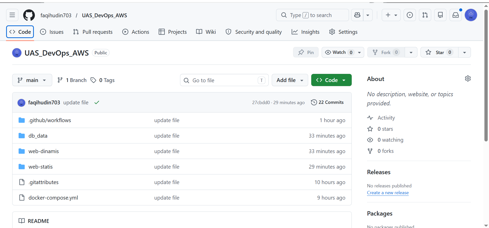

---

### 2. Membangun Kedua Aplikasi Web

**Web Statis** adalah halaman portofolio personal yang dibangun menggunakan Vite 5, React, Tailwind CSS v3, dan Lucide React. Proses build menghasilkan file HTML/CSS/JS statis di folder `dist/` yang kemudian di-serve oleh container Nginx.

**Web Dinamis** adalah platform manajemen artikel bernama REDAKSI, dibangun di atas Next.js 15 dengan autentikasi NextAuth v5 dan penyimpanan data di MariaDB. Ada dua halaman utama: landing page publik yang menampilkan daftar artikel, dan admin panel untuk mengelola konten.

---

### 3. Menyiapkan Docker Hub

Dua repository Docker Hub dibuat untuk menampung image hasil build:

| Aplikasi | Image |
|---|---|
| Web Statis | `faqih703/himafor_2388010020:latest` |
| Web Dinamis | `faqih703/web-dinamis:latest` |

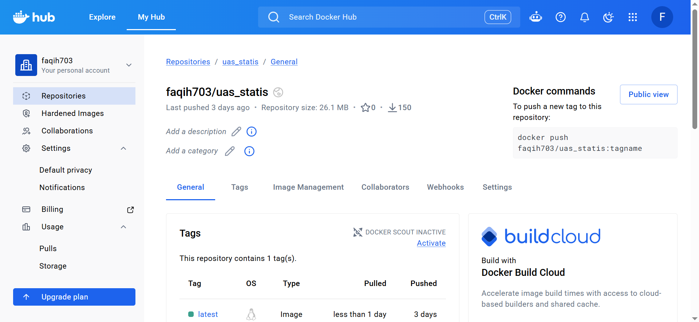


---

### 4. Menulis Workflow GitHub Actions

Kedua workflow ditulis dengan pendekatan **isolated paths** — pipeline statis hanya jalan jika ada perubahan di `web-statis/**`, pipeline dinamis hanya jalan jika ada perubahan di `web-dinamis/**`.

Contoh konfigurasi trigger pada `deploy.yaml`:

```yaml
on:
  push:
    branches: [main]
    paths:
      - "web-statis/**"
```

Setiap pipeline menjalankan empat langkah: checkout kode, login Docker Hub, build dan push image, kemudian SSH ke EC2 untuk menarik image terbaru dan merestart container.

---

### 5. Konfigurasi GitHub Secrets

Kredensial sensitif disimpan sebagai encrypted secrets di GitHub, tidak pernah ditulis langsung di kode.

| Secret | Fungsi |
|---|---|
| `DOCKERHUB_USERNAME` | Login Docker Hub |
| `DOCKERHUB_TOKEN` | Access token Docker Hub |
| `EC2_HOST` | Alamat IP publik server |
| `EC2_USER` | Username SSH |
| `EC2_SSH_KEY` | Private key untuk koneksi SSH |

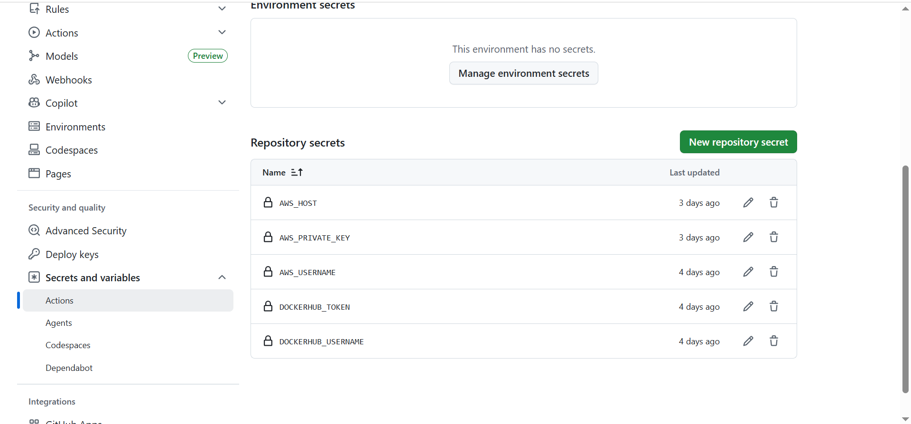

---

### 6. Membuat Instance EC2 di AWS

Instance Ubuntu dibuat di region Asia Pacific. Security Group dikonfigurasi untuk membuka tiga port yang diperlukan:

| Port | Kegunaan |
|---|---|
| 22 | Koneksi SSH dari GitHub Actions |
| 80 | Akses web statis (portfolio) |
| 3000 | Akses web dinamis (REDAKSI) |

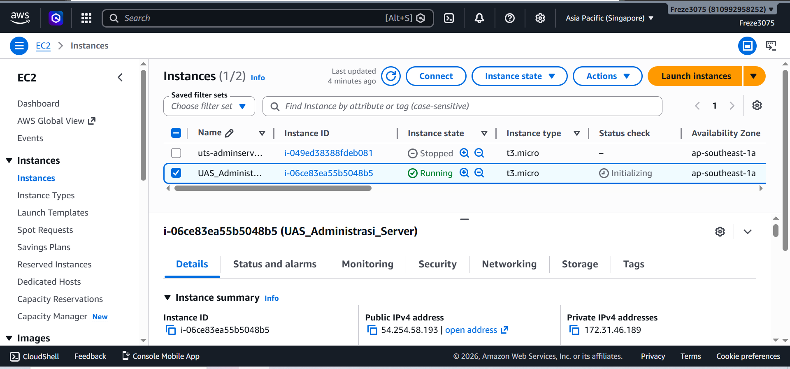
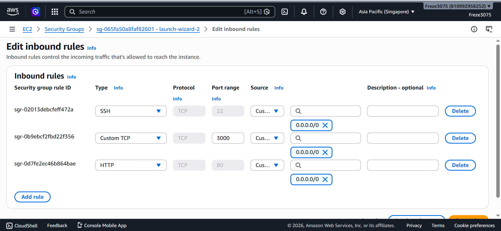

---

### 7. Instalasi Docker di EC2

Docker Engine dan Docker Compose Plugin diinstal langsung dari repository resmi Docker untuk Ubuntu:

```bash
sudo apt-get update
sudo apt-get install -y ca-certificates curl gnupg

sudo install -m 0755 -d /etc/apt/keyrings
curl -fsSL https://download.docker.com/linux/ubuntu/gpg | \
  sudo gpg --dearmor -o /etc/apt/keyrings/docker.gpg
sudo chmod a+r /etc/apt/keyrings/docker.gpg

echo "deb [arch=$(dpkg --print-architecture) \
  signed-by=/etc/apt/keyrings/docker.gpg] \
  https://download.docker.com/linux/ubuntu \
  $(. /etc/os-release && echo "$VERSION_CODENAME") stable" | \
  sudo tee /etc/apt/sources.list.d/docker.list > /dev/null

sudo apt-get update
sudo apt-get install -y docker-ce docker-ce-cli containerd.io \
  docker-buildx-plugin docker-compose-plugin

sudo usermod -aG docker ubuntu
```

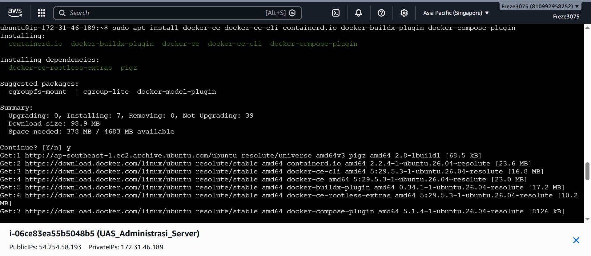

---

### 8. Konfigurasi docker-compose.yml

Tiga service diorkestrasi dalam satu file dan dihubungkan melalui jaringan internal `appnet`:

```yaml
services:
  db-webdinamis:      # MariaDB, tidak expose ke luar
  container-statis:   # Portfolio, port 80
  container-dinamis:  # REDAKSI, port 3000
```

Beberapa detail teknis yang penting: MariaDB dilengkapi `healthcheck` sehingga Next.js tidak mencoba koneksi sebelum database benar-benar siap. File SQL seed di-mount ke `/docker-entrypoint-initdb.d/` agar tabel dan data awal otomatis terbuat saat container pertama kali dijalankan.

---

### 9. Pipeline Berjalan Otomatis

Setelah kode di-push, GitHub Actions langsung mendeteksi perubahan dan menjalankan pipeline yang sesuai.

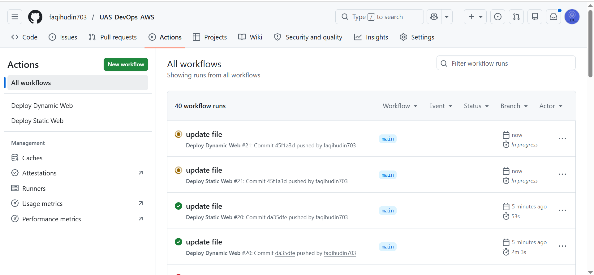

---

### 10. Verifikasi Web Statis

Portfolio dapat diakses di `http://<IP_EC2>` dan ditampilkan dengan benar oleh Nginx.

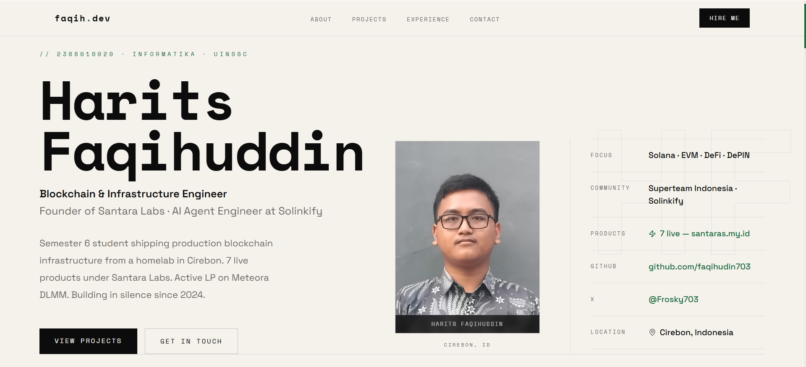

---

### 11. Verifikasi Web Dinamis

Landing page REDAKSI dapat diakses di `http://<IP_EC2>:3000` dan menampilkan daftar artikel dari database.

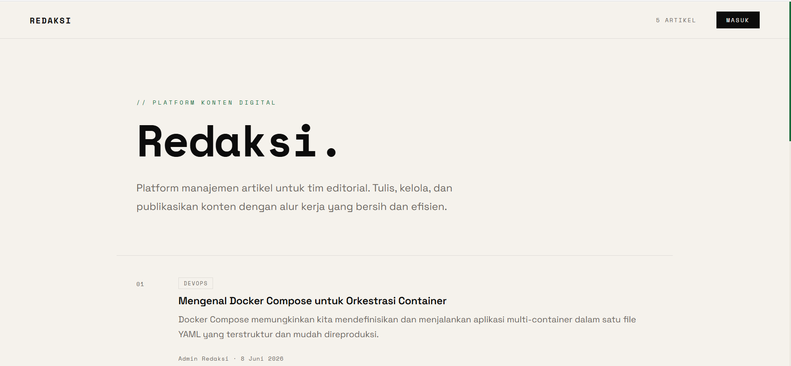

---

### 12. Uji Fungsi Admin

Login ke `http://<IP_EC2>:3000/login` menggunakan akun admin, kemudian menambahkan artikel baru dari dashboard.

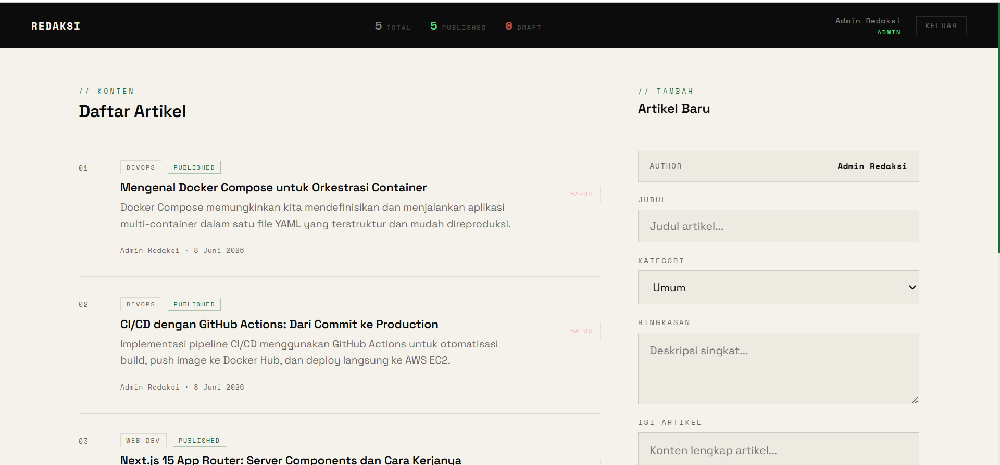

---

### 13. Artikel Baru Muncul di Halaman Publik

Kembali ke halaman utama untuk memastikan artikel yang baru saja ditambahkan sudah tampil tanpa perlu refresh paksa atau intervensi server.

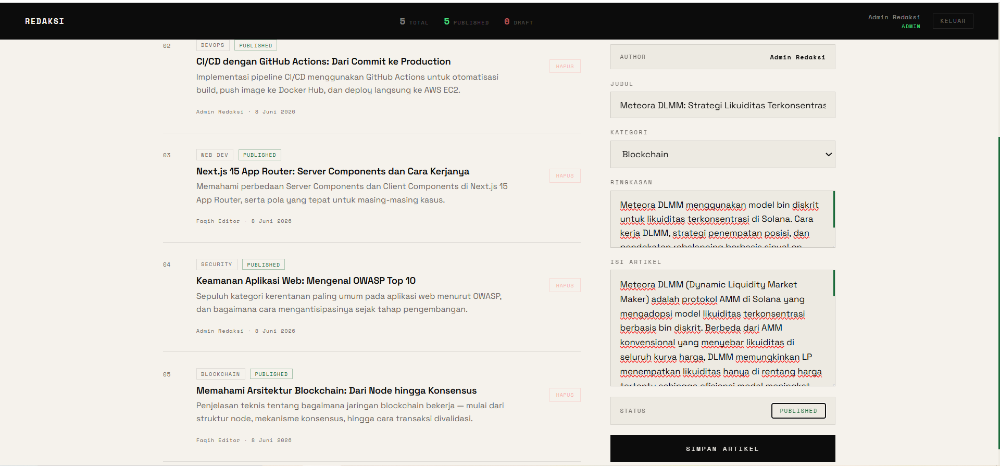

---

### 14. Uji Live Deployment — Web Statis

Melakukan perubahan kecil pada kode web statis secara lokal, kemudian commit dan push:

```bash
git add web-statis/
git commit -m "test: update konten hero"
git push origin main
```

GitHub Actions mendeteksi perubahan hanya pada `web-statis/**` dan menjalankan pipeline statis saja.

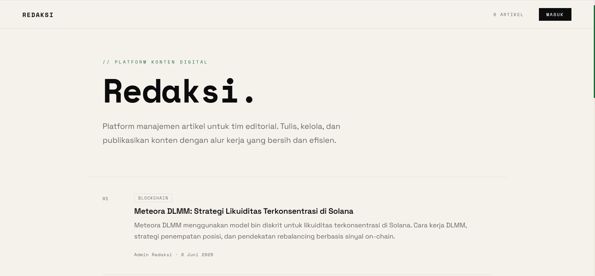

---

### 15. Perubahan Langsung Tampil Tanpa Sentuh Server

Setelah pipeline selesai berjalan, perubahan sudah langsung terlihat di browser. Tidak ada SSH manual, tidak ada `docker pull` manual — semuanya otomatis.

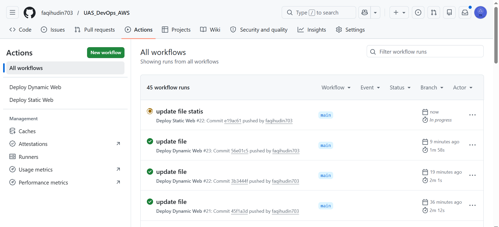

---

## Ringkasan Teknis

| Komponen | Teknologi |
|---|---|
| Web Statis | Vite 5 + React + Tailwind CSS v3 |
| Web Dinamis | Next.js 15 + NextAuth v5 + MariaDB |
| Containerisasi | Docker + Docker Compose |
| CI/CD | GitHub Actions |
| Registry | Docker Hub |
| Server | AWS EC2 (Ubuntu) |
